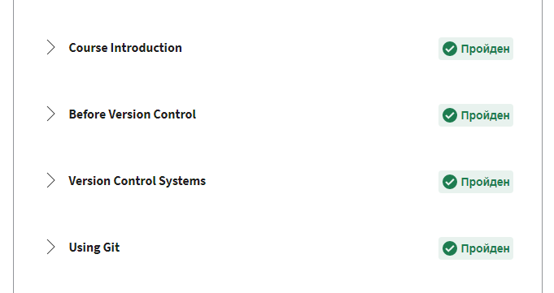
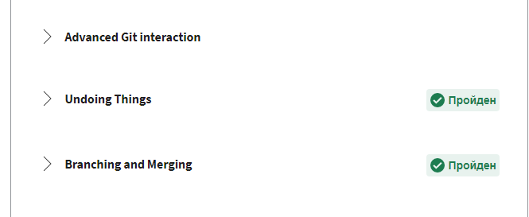
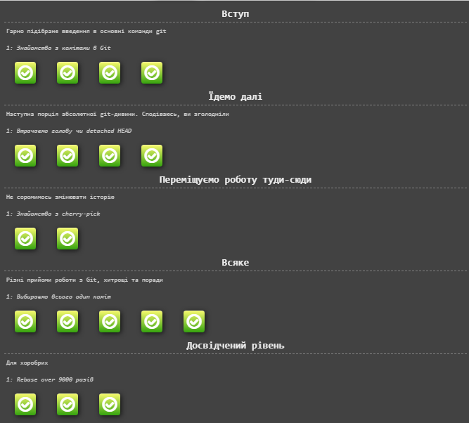
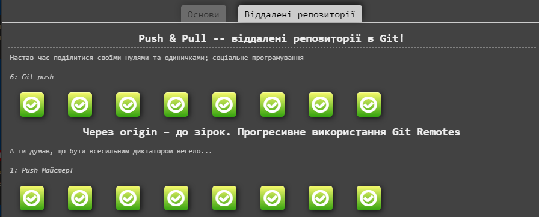
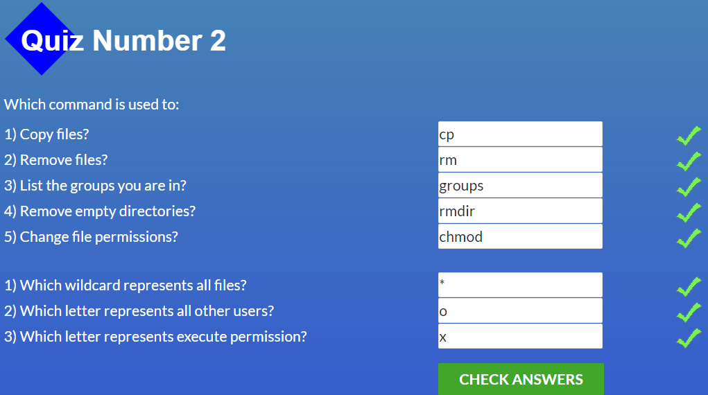
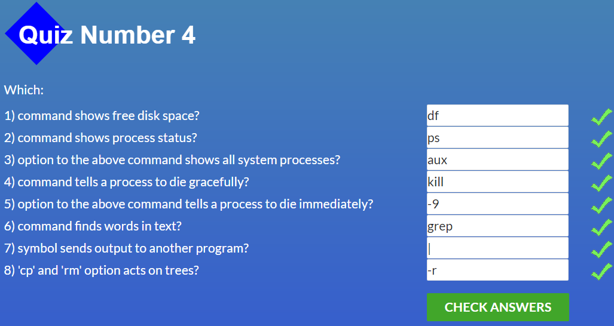
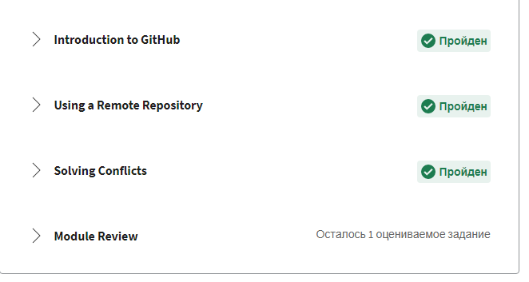
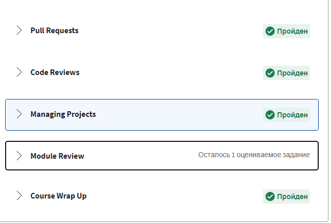

# Stage 0

## General
- [X] 1. [Git Basic](#1-git-basic) 
- [X] 2. [Linux CLI and Networking](#2-linux-cli-and-networking)
- [X] 3. [VCS, GitHub and Collaborating](#3-git-collaboration)

## Front-End Basic
- [ ] 1. Intro to HTML & CSS
- [ ] 2. Responsive Web Design
- [ ] 3. HTML & CSS Practice
- [ ] 4. JavaScipt Basics
- [ ] 5. Document Object Model 

## Advansed Topics
- [ ] 1. Building a Tiny JS World
- [ ] 2. Object oriented JS
- [ ] 3. OOP exercise
- [ ] 4. Offline Web Applications
- [ ] 5. Memory pair game
- [ ] 6. Website Perfomance Optimization 
- [ ] 7. Friends APP

### 1. Git Basic 
###  _Coursera course_

Course in coursera was very usefull for me. I learned the basic commands to do with GIT

coursera git 1 week
 

  

coursera git 2 week
 

  

### _learnGitBranch_

I am not sure that I fully understood all the concepts presented in this course, but I hope that everything will become clearer with practice

learn git branch basic
 

  

learn git branch remote
 

  

 ---

 ### 2. Linux CLI and Networking

 ###  _Linux Survival_
 It was very interesting to take this course, some commands were already known to me, but I am sure that this course was useful for me

quiz 1
 

  

quiz 2
 

  

quiz 3
 

  

quiz 4
 

  

 ###  _Networking_
 I hope that the concepts presented in these articles will become more clear during further work

---

### 3. GIT Collaboration
I will return to these lessons later to consolidate my knowledge

coursera git 3 week
 

  

coursera git 4 week
 

  

learn git branch basic
 

  

learn git branch remote
 

  

---
