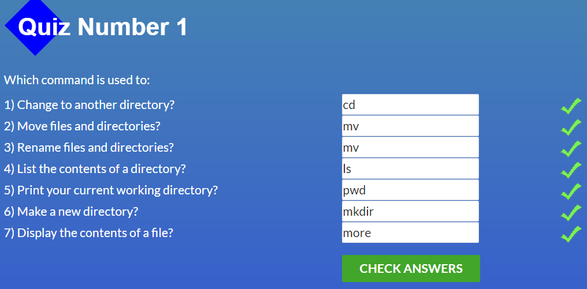
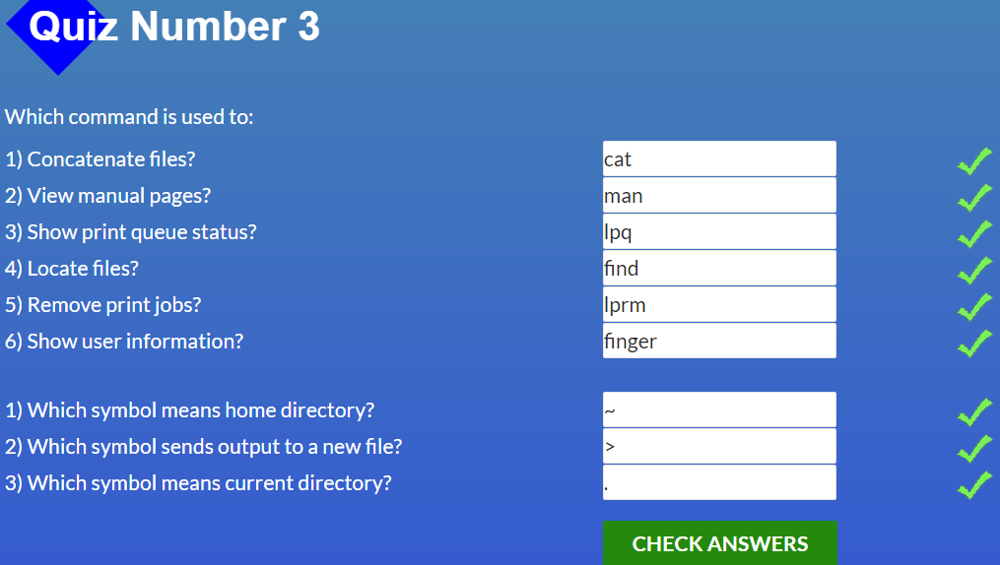

# Stage 0

## General
- [X] 1. [Git Basic](#1-git-basic) 
- [X] 2. [Linux CLI and Networking](#2-linux-cli-and-networking)
- [X] 3. [VCS, GitHub and Collaborating](#3-git-collaboration)

## Front-End Basic
- [X] 1. [Intro to HTML & CSS](#1-intro-to-html-and-css)
- [X] 2. [Responsive Web Design](#2-responsive-web-design)
- [X] 3. [HTML & CSS Practice](#3-html--css-practice)
- [ ] 4. JavaScipt Basics
- [ ] 5. Document Object Model 

## Advansed Topics
- [ ] 1. Building a Tiny JS World
- [ ] 2. Object oriented JS
- [ ] 3. OOP exercise
- [ ] 4. Offline Web Applications
- [ ] 5. Memory pair game
- [ ] 6. Website Perfomance Optimization 
- [ ] 7. Friends APP

---
## **General** 

### **1. Git Basic**
###  Coursera course

Course in coursera was very usefull for me. I learned the basic commands to do with GIT

coursera git 1 week
 

  

coursera git 2 week
 

  

### learnGitBranch

I am not sure that I fully understood all the concepts presented in this course, but I hope that everything will become clearer with practice

learn git branch basic
 

  

learn git branch remote
 

  

    

 ### **2. Linux CLI and Networking**
 ###  Linux Survival
 It was very interesting to take this course, some commands were already known to me, but I am sure that this course was useful for me

quiz 1
 

  

quiz 2
 

  

quiz 3
 

  

quiz 4
 

  

 ###  Networking
 I hope that the concepts presented in these articles will become more clear during further work

### **3. GIT Collaboration**
I will return to these lessons later to consolidate my knowledge

coursera git 3 week
 

  

coursera git 4 week
 

  

learn git branch basic
 

  

learn git branch remote
 

  

---

## **Front-End Basic**

### **1. Intro to HTML and CSS**

I already knew all the topics, but it was useful to repeat the semantic tags and positioning of elements
### Coursera HTML, CSS, and Javascript for Web Developers

week 1

week 2

### CodeCademy Learn HTML&CSS

Learn HTML&CSS

### **2. Responsive Web Design**

Flexboxes and grids are very interesting and useful topics to use in the project, but in my opinion, these topics are not fully revealed in these two games. I think that I need more practice to better understand them and implement them in the project without problems

Flexbox froggy

grid garden

### 3. HTML & CSS Practice
[Demo](https://anishchenko.github.io/Html-Css-Popup-Task)
[Repo](https://github.com/anishchenko/Html-Css-Popup-Task)

This task turned out to be **more difficult** than I thought before its implementation. but it gave me more practice with flexboxes, grids and responsive design
